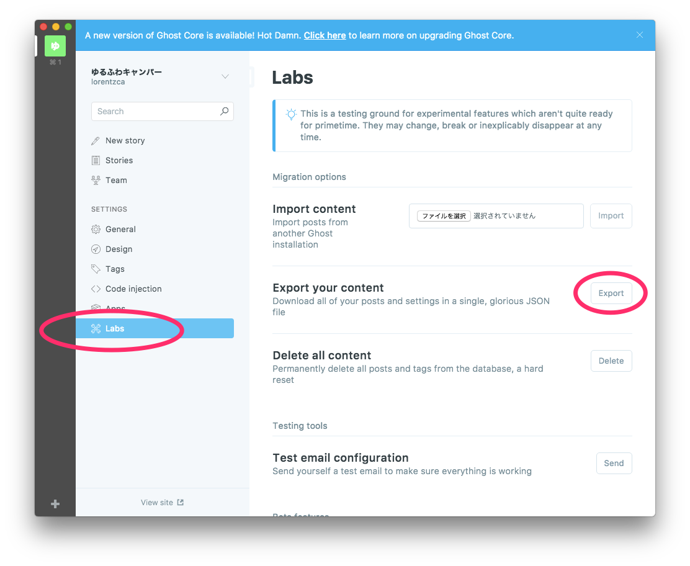
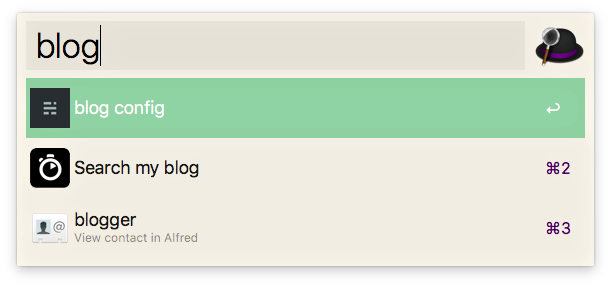
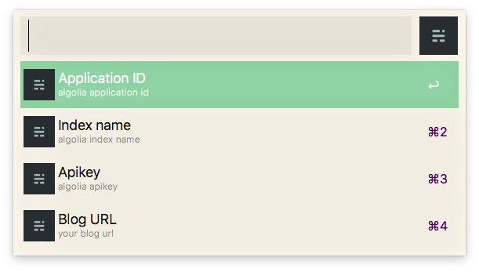
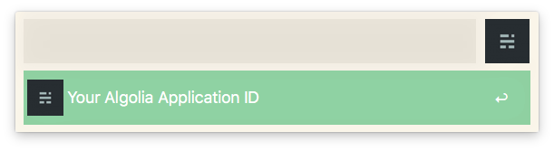
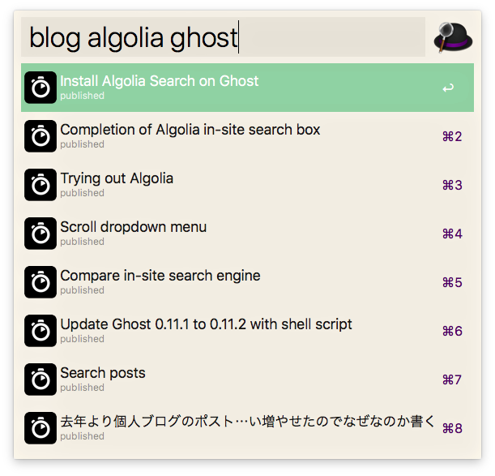

# Search Myblog

Search my blog posts.

## Require

1. Export Ghost blog.

    

2. Extract only posts.
    - `cat <exported your blog>.json | jq '.db[].data.posts' > posts.json`
3. Indexing your `posts.json`.
    - [ Indexing Overview | Indexing Guide | Algolia Documentation ](https://www.algolia.com/doc/guides/indexing/indexing-overview/#indexing-via-the-dashboard)
4. Get readonly API key and Application ID.
    - [credentials page](https://www.algolia.com/licensing)

## Usage

### Configure seach source(Algolia) and blog's URL

### Search posts

